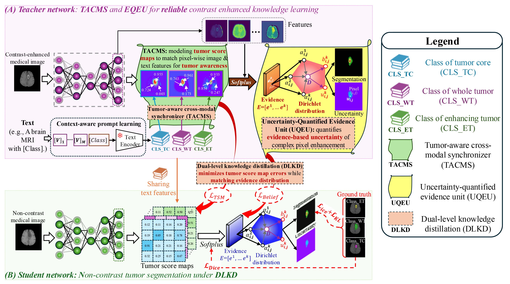

# Evidence-guided-Knowledge-Distillation
Implementation of "When Evidence Modeling Meets Knowledge Distillation: Towards Reliable Contrast-Enhanced Knowledge Distillation for Non-Contrast Medical Image Segmentation".

  

  <b>Figure:</b> Overview of Evidence-guided-Knowledge-Distillation.

## 🧠 Overview

This repository contains the official implementation of the paper:

**"When Evidence Modeling Meets Knowledge Distillation: Towards Reliable Contrast-Enhanced Knowledge Distillation for Non-Contrast Medical Image Segmentation"**

If you find this work helpful, please consider citing our paper.

## 📝 Citation

## 📦 Installation
# Clone the repository
git clone https://github.com/JianfengZhao/Evidence-guided-Knowledge-Distillation.git
cd Evidence-guided-Knowledge-Distillation

# Create and activate a new environment
conda create -n egta-kd python=3.8 -y
conda activate egta-kd

# Install all dependencies
pip install -r requirements.txt

